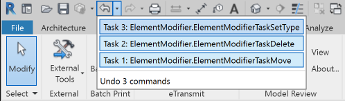

# ElementModifier

Revit C# .NET add-in that applies a specified modification to an element, e.g., move, delete, change type.

ElementModifier implements an external command that receives a set of commands and applies them.

The commands are read from a JSON input file `C:\tmp\element_modifier_tasks.txt` specifying the actions to apply.

The add-in attempts to apply them to the BIM and reports both successful processing and any problems encountered back to the log file.

Here is a subset of defined commands:

- move_element_within_host(unique_id, new_position) &ndash; do not change the host element
- move_hostless_element(unique_id, new_position)
- delete_element(unique_id)
- change_element_type(unique_id, old_type_id, new_type_id)

The operations are reversible, i.e., can be undone, e.g., using Ctrl + Z.

If any problem crops up executing the operation in the BIM (and it will!) the operation is simply cancelled and the failure reported back to `C:\tmp\element_modifier_log.txt`.


## Command File Format

The command file format is quite flexible.

Three command tokens are supported:

- delete
- move
- settype

All three require a second token, the unique id of the element to modify.

Delete is happy with just that.

Settype requires the element id of the new type to set.

Move requires three tokens for the X, Y and Z coordinates of the new location point.

The tokens can be separated by parenthesis, commata or just spaces.

Comment lines starting with `#` are supported.

White space is ignored.

Any violation of this format throws an exception and terminates the add-in execution.

Hence, this ia a valid command file:

```
  Delete(3ded2a48-367f-42c7-83bd)
  Move(3ded2a48-367f-42c7-83bd,1,0,0)
  SetType(3ded2a48-367f-42c7-83bd,1234567)
```

So is this:

```
  # 2020-01-16 test input file
  delete 3ded2a48-367f-42c7-83bd
  move 3ded2a48-367f-42c7-83bd 1 0 0
  settype 3ded2a48-367f-42c7-83bd 1234567
```

Here is a [sample command file used for successful testing](test/element_modifier_tasks_little_house.txt) in the little house model.

It moves a windiow, deletes a door and changes the type of the second window, producing the following undo stack in the user interface:

 <!-- 498 -->

## Author

Jeremy Tammik, [The Building Coder](http://thebuildingcoder.typepad.com), [ADN](http://www.autodesk.com/adn) [Open](http://www.autodesk.com/adnopen), [Autodesk Inc.](http://www.autodesk.com)


## License

This sample is licensed under the terms of the [MIT License](http://opensource.org/licenses/MIT).
Please see the [LICENSE](LICENSE) file for full details.

